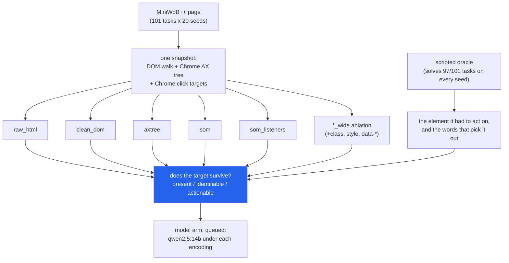

<h1 align="center">browser-agent (Playwright · MiniWoB++ · Chrome DevTools Protocol · Ollama)</h1>
<p align="center"><i>Before asking which page encoding a browser agent should read, ask what each one throws away</i></p>

<p align="center">
  <a href="#the-through-line">The through-line</a> &middot;
  <a href="#findings">Findings</a> &middot;
  <a href="#input--output">Input / Output</a> &middot;
  <a href="#quick-start">Quick start</a> &middot;
  <a href="#what-this-does-not-do">What it does NOT do</a> &middot;
  <a href="#problems-hit-while-building-this">Problems hit</a>
</p>

<p align="center">
  
  
  
  
  
  <a href="LICENSE"></a>
</p>

---

Inspired by [browser-use](https://github.com/browser-use/browser-use) and
[browserbase/stagehand](https://github.com/browserbase/stagehand); no code from either is used.

## The through-line



A browser agent never sees the page. It sees an *encoding* of the page: raw HTML, a cleaned
DOM, the accessibility tree, or a numbered list of interactive elements. Every encoding is
cheaper than the one before it because it drops something. This repo measures what, without a
model: a scripted oracle solves each task through the same action layer the agent uses, and at
every step the element it acts on is looked up in all five encodings, plus two ablation
variants that widen the attribute allow-list.

> **A numbered list of interactive elements is 3.6x cheaper than raw HTML and keeps 93% of the
> targets raw HTML shows, no detectably fewer than a cleaned DOM at half its tokens, but only
> when it asks Chrome which elements have click listeners; the usual attribute-and-cursor
> heuristic keeps 86%. Most of what it still loses (colour, icon identity) is thrown away by
> the attribute allow-list, not by being text: keeping `class` and `style` too raises it to
> 98% at 39% of raw HTML's tokens.**

## Findings

All numbers come from `results/*.json`, produced by `browser-agent oracle --seeds 20` and
`browser-agent report` on this machine. The unit is the task: each task contributes its mean
over seeds, and the intervals are 95% bootstraps over the 101 tasks. Survival counts only the
5,742 target steps of episodes the oracle actually solved.

| encoding | tokens, median first page | share of raw HTML | targets kept, of those raw HTML shows (95% CI) | tasks losing any | episodes where every target is usable |
|---|---:|---:|---:|---:|---:|
| `raw_html` | 210 | 1.00 | 1.000 (reference) | 0 | 0.914 |
| `clean_dom` | 113 | 0.57 | 0.925 [0.878, 0.965] | 13 | 0.804 |
| `axtree` | 63 | 0.31 | 0.899 [0.847, 0.946] | 18 | 0.739 |
| `som` | 54 | 0.26 | 0.863 [0.801, 0.918] | 22 | 0.710 |
| `som_listeners` | 71 | 0.28 | **0.931** [0.890, 0.969] | 13 | 0.811 |
| *ablation:* `clean_dom_wide` | 178 | 0.95 | 0.979 [0.951, 1.000] | 3 | 0.888 |
| *ablation:* `som_listeners_wide` | 112 | 0.39 | **0.976** [0.948, 0.997] | 4 | 0.885 |

The `_wide` rows are the same encoders with `class`, `style` and every `data-*` attribute
added to the allow-list (`id`, `name`, `type`, `placeholder`, `aria-label`, `title`, `role`,
`href`, `alt`, `for`, plus live form state). They are an ablation of that one choice, not a
recommendation; see finding 3 for what the extra attributes carry.

"Kept" means the target is still *identifiable* and reachable by an index. Identifiable: the
facts that pick the target out from its neighbours (its label, the colour it is described by,
the field name) appear, as whole words, in what the encoding says about the target itself or
a label bound to it: tag or role names, attribute values, text, accessible names and states,
never an index number or markup. Those facts ("needs") are chosen by hand per task and
written the way the page carries them, which is not always the instruction's wording: "delete
it" is carried by an icon whose only name is its `trash` class, "the shortest flight" by a
duration printed on the page. The harness therefore tags every need by where an agent could
find it. Of the 4,638 needs checked, 3,173 are in the instruction, 1,190 only in the page's
visible text, and 275 only in markup (tag names, ids, classes). 1,307 of the 5,742 target
steps (23%) have no needs (picked by position, or the only one of their kind); for those,
present is enough. Every fragment a cleaned encoding emits carries an index, so for them
"reachable" equals "present". "Share of raw HTML" is the median over tasks of the per-task
token ratio.

**Sensitivity to the needs.** Recomputing "kept" with the markup-only needs dropped
(`sensitivity_usable_given_raw`) moves every encoder up by at most 1.6 points and changes no
ranking; dropping the page-text needs as well changes nothing further.

| encoding | all needs | markup-only needs dropped | tasks losing any (dropped) |
|---|---:|---:|---:|
| `clean_dom` | 0.925 | 0.933 [0.891, 0.972] | 12 |
| `axtree` | 0.899 | 0.914 [0.865, 0.958] | 16 |
| `som` | 0.863 | 0.877 [0.821, 0.930] | 20 |
| `som_listeners` | 0.931 | 0.946 [0.909, 0.980] | 11 |
| `clean_dom_wide` | 0.979 | 0.984 [0.957, 1.000] | 2 |
| `som_listeners_wide` | 0.976 | 0.981 [0.953, 1.000] | 3 |

Paired differences in "kept" (per-task difference, bootstrapped over tasks), from
`contrasts_usable_given_raw`:

| comparison | mean difference | 95% CI |
|---|---:|---:|
| `som_listeners` - `som` | +0.069 | [+0.029, +0.115] |
| `clean_dom` - `som_listeners` | -0.006 | [-0.025, +0.006] |
| `clean_dom` - `axtree` | +0.027 | [-0.017, +0.073] |
| `som_listeners` - `axtree` | +0.033 | [-0.007, +0.077] |
| `clean_dom_wide` - `clean_dom` | +0.054 | [+0.022, +0.094] |
| `som_listeners_wide` - `som_listeners` | +0.045 | [+0.015, +0.080] |

1. **Listener detection is the cheapest win.** `som` finds interactive elements the way most
   DOM agents do: tag, ARIA role, `onclick`/`tabindex`, or where `cursor: pointer` starts.
   MiniWoB++ binds its handlers with d3 and jQuery, which leave no attribute behind. Asking
   Chrome for its own click-target flag (`DOMSnapshot.isClickable`) cut the tasks losing a
   target from 22 to 13 (the Reply and Forward buttons of four `email-inbox` variants,
   social-media, grid-coordinate, tic-tac-toe, ascending-numbers, form-sequence-3), for 16
   more tokens at the median; it adds elements to the list, so it cannot lose any. The gain,
   +0.069 [+0.029, +0.115], is the only contrast between the five main encoders whose interval
   excludes zero. With it, the list shows no detectable difference from `clean_dom` (-0.006, CI -0.025 to
   +0.006) at half the tokens; that interval rules out a gap larger than about 2.5 points.
2. **The accessibility tree loses unlabelled form fields and unnamed controls.** `login-user`
   and `login-user-popup` put a `<label>` next to each input without `for=` and without
   wrapping it, so Chrome gives both textboxes an empty name. The tree shows `text "Username"`
   and a nameless `textbox` on separate lines; the id `username` that every HTML encoding keeps
   is gone. Of the 18 tasks `axtree` loses, 8 are ones `clean_dom` keeps: those two, the Send
   buttons of four `email-inbox` variants (an unnamed `<span>`), and the grid-coordinate and
   tic-tac-toe cells. The Send losses rest on the need `send`, which is the button's id, not
   an instruction word; with markup-only needs dropped `axtree` loses 16 tasks, not 18.
3. **Ten tasks lose a target in every one of the four main cleaned encodings, and that is an
   allow-list choice.** Combining them does not help (the best pair, `axtree` +
   `som_listeners`, keeps 0.949 [0.911, 0.981]): they are the tasks decided by colour
   (`click-color`, `click-shades`), SVG shape kind (`click-shape`), and icon-only buttons named
   only in a CSS class (the star and trash icons of six `email-inbox` variants, the
   `use-spinner` arrows), and all four drop the attributes that carry that. Raw HTML, also
   text, keeps them. Adding `class`, `style` and `data-*` to the allow-list lifts `clean_dom`
   by +0.054 [+0.022, +0.094] and `som_listeners` by +0.045 [+0.015, +0.080];
   `som_listeners_wide` then loses only 4 tasks (`click-shape`, `find-greatest`,
   `navigate-tree`, `terminal`) at a median 112 tokens, against 71 for `som_listeners` and 210
   for raw HTML. Wide `clean_dom` buys almost nothing over raw HTML in tokens (0.95 of it).
   Where the rescue comes from matters, because MiniWoB++ often writes the grader's answer into
   `data-*`: `scripts/wide_attribution.py` (`results/wide_attribution.json`) reruns the tasks
   the narrow encoders lose with `class` and `style` but no `data-*`. Every rescue survives
   except `click-shades`, whose shades are `hsl(...)` in `style` and named only in
   `data-color`; that one is a grading artefact a real page would not offer.
4. **Cleaning does not always shrink the page.** `clean_dom` indexes every surviving element
   (`i=N`), and on 19 of 101 tasks, all small forms and checkbox lists, that made it *longer*
   than the raw HTML it came from.
5. **Raw HTML is not the ceiling it looks like.** It shows every target (present = 1.000, by
   construction), but on 10 tasks the deciding fact sits *next to* the element rather than in
   it: the post author beside a retweet icon, the duration beside a Book button, a label that
   is not bound to its input. Raw HTML only makes 91.4% of episodes fully usable, and 57% of
   its targets have a unique `#id` (task mean); the rest need a structural CSS selector. It
   also leaks: `find-greatest`'s face-down card values sit in the DOM at `font-size: 0`, and
   raw HTML and the accessibility tree both show them to an agent that should not see them.

The oracle itself solves 97 of 101 in-scope tasks on all 20 seeds (98.9% of 2,020 episodes).
The four exceptions are explained, not guessed, in `results/oracle.json`: `click-menu` opens
submenus on hover only (4/20), `click-pie` and `click-pie-nodelay` lose the click when the
answer is the item the wheel starts on (17/20 each), and `stock-market` (19/20) has a buying
window that can be shorter than one observe-and-encode cycle, which now includes seven
encodings. It solved 20/20 in the previous run: it depends on machine load, as does
`button-delay`, whose 150 ms tolerance spans one cycle.

### The model arm (built, tested with a fake, queued)

The findings above bound what a model *could* do with each encoding. Whether
`qwen2.5:14b-instruct` actually does it is queued: `scripts/run_models.sh` runs every
oracle-solved (task, seed) for seeds 0-4 under all seven encodings, 3,381 episodes and about
13,020 calls (26,040 at most), then reports, per model (never pooled), success per encoding and
family with Wilson intervals, steps, tokens, and success split by whether that episode's
targets were usable in the encoding. The three timing-bound tasks (`button-delay`,
`simon-says`, `stock-market`) are left out by default: a model taking seconds per step fails
them whatever it reads, and longer encodings fail them more, so they would measure latency,
not the encoding (`--include-timing` adds them back). The model
acts only through the handles its encoding shows (indices, or CSS selectors for raw HTML), may
`wait` up to 5 s like the oracle does, and a prompt too long for the context window is
recorded as an overflow rather than silently truncated. No vision model is installed, so
there is **no screenshot arm**; finding 3 is the case one would test.

## Input / Output

Real output from `uv run python demo.py` (the oracle solves each page; the benchmark's own
reward confirms it) and from `browser-agent show`. `P`/`I`/`A` = present / identifiable /
actionable; `.` = lost.

**1. A colour exists only in raw HTML.** `click-color`, seed 0:

```
click-color (seed 0): Click on the white colored box.
  benchmark reward: +1.0 after 1 steps
  tokens, first observation: raw_html 99  clean_dom 20  axtree 0  som 0  som_listeners 28  clean_dom_wide 111  som_listeners_wide 88
  step 1 click  needs [white]  raw_html PI.  clean_dom ...  axtree ...  som ...  som_listeners P.A  clean_dom_wide PIA  som_listeners_wide PIA
```

The boxes are `<div class="color" data-color="white" style="background-color: white;">`
with a d3 click handler: the colour is only in attributes the narrow allow-list drops.
`clean_dom` then prunes them as empty, the accessibility tree is empty, `som` sees nothing
interactive, and `som_listeners` lists four indistinguishable lines, `[3]<div></div>` to
`[6]<div></div>`: clickable, but which one is white? The wide variant keeps it (from
`browser-agent show click-color --seed 0`):

```
=== som_listeners_wide (88 tokens)
[3]<div class="color" data-color="cyan" style="background-color: cyan;"></div>
[4]<div class="color" data-color="red" style="background-color: red;"></div>
[5]<div class="color" data-color="white" style="background-color: white;"></div>
[6]<div class="color" data-color="black" style="background-color: black;"></div>
```

**2. The accessibility tree drops the field names.** `login-user`, seed 0:

```
login-user (seed 0): Enter the username "thaddeus" and the password "UT" into the text fields and press login.
  benchmark reward: +1.0 after 3 steps
  tokens, first observation: raw_html 101  clean_dom 103  axtree 35  som 55  som_listeners 55  clean_dom_wide 115  som_listeners_wide 67
  step 1 type   needs [username]  raw_html PIA  clean_dom PIA  axtree P.A  som PIA  som_listeners PIA  clean_dom_wide PIA  som_listeners_wide PIA
  step 2 type   needs [password]  raw_html PIA  clean_dom PIA  axtree P.A  som PIA  som_listeners PIA  clean_dom_wide PIA  som_listeners_wide PIA
  step 3 click  needs [login]  raw_html PIA  clean_dom PIA  axtree PIA  som PIA  som_listeners PIA  clean_dom_wide PIA  som_listeners_wide PIA
```

```
=== axtree (35 tokens)
- text "Username" [5]
- textbox [6]
- text "Password" [8]
- textbox [9]
- button "Login" [10]

=== som (55 tokens)
[5]<label>Username</label>
[6]<input id="username" type="text">
[8]<label>Password</label>
[9]<input id="password" type="password">
[10]<button id="subbtn">Login</button>
```

**3. Shape kind survives only as a tag name** (the need `rect` is a markup-sourced one).
`click-shape`, seed 1:

```
click-shape (seed 1): Click on a rectangle
  benchmark reward: +1.0 after 1 steps
  tokens, first observation: raw_html 294  clean_dom 59  axtree 62  som 54  som_listeners 69  clean_dom_wide 121  som_listeners_wide 99
  step 1 click  needs [rect]  raw_html PI.  clean_dom ...  axtree P.A  som PIA  som_listeners PIA  clean_dom_wide PIA  som_listeners_wide PIA
```

**4. Hidden sections cost raw HTML 7x the tokens and change nothing.** `click-collapsible-2`,
seed 0:

```
click-collapsible-2 (seed 0): Expand the sections below, to find and click on the link "ut.".
  benchmark reward: +1.0 after 2 steps
  tokens, first observation: raw_html 751  clean_dom 97  axtree 52  som 70  som_listeners 70  clean_dom_wide 186  som_listeners_wide 148
  step 1 click  needs [Section #2]  raw_html PIA  clean_dom PIA  axtree PIA  som PIA  som_listeners PIA  clean_dom_wide PIA  som_listeners_wide PIA
  step 2 click  needs [ut.]  raw_html PI.  clean_dom PIA  axtree PIA  som PIA  som_listeners PIA  clean_dom_wide PIA  som_listeners_wide PIA
```

**5. The whole run**, from `browser-agent report`:

```
oracle: 97/101 tasks solved on every seed, 98.9% of 2020 episodes

encoder              tokens (median)   present  identif.   action.   ceiling
raw_html                         210     1.000     0.944     0.573     0.914
clean_dom                        113     0.918     0.869     0.918     0.804
axtree                            63     0.964     0.843     0.964     0.739
som                               54     0.879     0.813     0.879     0.710
som_listeners                     71     0.987     0.875     0.987     0.811
clean_dom_wide                   178     0.990     0.923     0.990     0.888
som_listeners_wide               112     0.987     0.920     0.987     0.885
```

## Quick start

```bash
git clone <this repo> browser-agent
cd browser-agent
uv sync
uv run playwright install chromium      # skip if Playwright's Chromium is already installed

uv run pytest -q                        # 94 tests, no network, no model
uv run python demo.py                   # four pages, seven encodings, known answers
uv run browser-agent tasks              # the 101 runnable tasks and the 29 left out, with reasons
uv run browser-agent show click-color --seed 0
uv run browser-agent oracle --seeds 20  # ~1 h; resumable, writes results/oracle_episodes.jsonl
uv run browser-agent report             # results/oracle.json, tokens.json, survival.json
uv run python scripts/wide_attribution.py   # results/wide_attribution.json (~5 min)

bash scripts/run_models.sh --dry-run    # the model-arm job list and call estimate
bash scripts/run_models.sh              # checks RAM, GPU and Ollama first, then runs
```

## Layout

```
src/browser_agent/
  pages.py        serves vendor/miniwob to Chromium through Playwright's router; no socket
  env.py          seeded MiniWoB++ episodes, rewarded by the benchmark's own globals
  snapshot.js     one DOM walk: stable data-ba-id stamps, text, visibility, live form state
  snapshot.py     merges the walk with Chrome's AX tree and click targets (CDP)
  encoders.py     raw_html, clean_dom, axtree, som, som_listeners, and the two *_wide variants
  actions.py      click / type / select / scroll / submit / wait / done, by index or selector
  survival.py     present / identifiable / actionable, and where each need comes from
  oracles/        scripted policies for 101 tasks (click, forms, reading, widgets)
  harness.py      oracle episodes -> results/oracle_episodes.jsonl
  report.py       oracle.json, tokens.json, survival.json, agent.json
  agent.py        the model arm: prompts, context-window guard, step budgets, jobs
  llm.py          Ollama client, on-disk generation cache, deterministic fake
  tasks.py        task families, exclusions, and the explained oracle limits
  tokens.py       Qwen2.5 token counts from the vendored tokenizer
vendor/miniwob/   MiniWoB++ pages pinned to commit 33c3b4d, checksummed (MIT, see LICENSE)
vendor/qwen2.5-tokenizer.json.gz   the Qwen2.5 tokenizer (a BPE table, not weights)
scripts/          fetch_miniwob.py, capture_fixture.py, wide_attribution.py, run_models.sh
results/          every number in this README
```

## Requirements

Python 3.11+, `uv`, and Playwright's Chromium build (`uv run playwright install chromium`;
the full build is launched in new-headless mode, so the separate headless-shell download is
not needed). No GPU, no model and no network are needed for anything except the model arm,
which needs Ollama serving `qwen2.5:14b-instruct` and roughly 12 GB of free VRAM.

## Tests

```bash
uv run pytest -q
```

94 tests. The encoder and survival tests run on snapshots saved from real task pages
(`tests/fixtures/`), so they need no browser. The browser tests (`-m browser`) drive real
Chromium: seeded resets are deterministic, a wrong click gets the benchmark's negative reward,
the executor refuses indices the agent was not shown, pages cannot reach the network, and the
agent loop runs end to end against a fake model that reads the set-of-marks, a raw-HTML agent
that must fall back to selectors, a model that never returns JSON, and a prompt too long for
the context window (never sent), an agent on an indexed encoding trying a CSS selector
(refused), a page error (a counted failure) and a dead browser (the run stops, nothing is
recorded, resume retries). The Ollama client is tested against a local socket that drops,
stalls, or returns garbage or an error payload: each is retried, then one clean error. They skip, rather than fail, when Chromium is missing.

## What this does NOT do

- **It does not say which encoding makes a model succeed.** Survival is an upper bound on what
  a model could do with an encoding. The model arm that measures actual success is built and
  queued, not run.
- **No screenshot arm.** No vision model is installed. The four tasks even the wide
  allow-list loses, and the colour tasks a real page would not label in `data-*`, are the
  obvious place to test one.
- **It does not cover real websites.** MiniWoB++ pages are tiny (210 tokens of raw HTML at the
  median, 5,813 at most). Ratios between encodings transfer better than absolute counts.
- **"Identifiable" is strict and literal, and is not a uniqueness test.** The deciding words
  must appear in the element's own representation or a label bound to it; text merely nearby
  does not count, and it does not check that the words pick out *only* the target. The words
  themselves were chosen per task by hand (they are in `src/browser_agent/oracles/`), written
  the way the page carries them; each is tagged instruction / page / markup and the results
  are reported with the markup-only ones dropped. A model
  may still guess right from adjacency; the model arm's survival split measures how often.
- **The action space has no hover action, no drag and no text selection.** (A click does move
  the pointer onto the element first; no action hovers without clicking.) 29 tasks that need
  one are excluded up front and listed by `browser-agent tasks`, three of them
  (`form-sequence`, `hot-cold`, `text-editor`) after an oracle was attempted and failed for
  that reason.
- **It is not browser-use or Stagehand.** It rebuilds the observation-and-action core those
  projects share, to measure it; there is no planner, memory, vision, or cloud browser.

## Problems hit while building this

- **Playwright 1.63 looks for a separate `chromium-headless-shell` build** that was not
  installed; only full Chromium was. Launching with `channel="chromium"` uses the full build in
  new-headless mode.
- **Git rewrote the vendored pages.** With `core.autocrlf=input`, committing converted the
  MiniWoB++ files' line endings, so a fresh clone failed the blob checksums in
  `MANIFEST.json`. `.gitattributes` now marks `vendor/**` as `-text`.
- **Pages served through the router had no charset.** Chromium fell back to windows-1252, and
  `unicode-test`'s `ÖK` arrived as `ÖK`: the task still "worked", but it was no longer testing
  unicode. HTML, JS and CSS are now served as UTF-8.
- **Routing requests disables Playwright's HTTP cache**, and `social-media` swaps each icon's
  image on hover. While the hover image loaded, the icon collapsed to zero width and the click's
  mousedown landed on its neighbour: 1 of 20 seeds solved. The executor now moves the pointer,
  waits 60 ms, then clicks; 20 of 20.
- **One button can sit over another** (`click-test-2`, seeds 6 and 13), and Playwright refuses a
  click whose centre is covered. The executor finds an uncovered point of the element first.
- **A closed `<select>`'s options fail `checkVisibility()`**, so the cleaned encodings silently
  dropped every choice but the selected one. Options now count as visible when their select is.
- **Typing timed out under load.** One 3 s budget for a whole `press_sequentially` failed
  `copy-paste-2`'s 60-character strings on 14 of 20 seeds while other jobs held the CPU. The
  budget now grows with the text.
- **Ollama silently drops the start of a prompt longer than `num_ctx`.** The model arm counts
  tokens with the Qwen2.5 tokenizer first and records a `context_overflow` instead of sending a
  prompt the model would only partly see.
- **Raw HTML's "present = 1.000" looked like a bug** and is not: the encoding is the page body,
  so every target is in it. The informative number is the conditional one: of the targets raw
  HTML shows identifiably, how many each cheaper encoding keeps.
- **The headline was true by construction.** A second review pointed out that "no text
  encoding keeps colour or icon identity" only held because every cleaned encoding shared one
  attribute allow-list without `class`, `style` or `data-*`; raw HTML is text and kept them.
  The `_wide` ablation now measures that choice, and the claim was rewritten to what it shows.
- **The first identifiability check was too easy to pass.** It searched the rendered text, so
  a needed "5" was satisfied by the index `[5]` and a needed ">" by any tag's closing bracket.
  An independent review caught it; fragments now carry their content without indices or
  markup, and needs match as whole words. The whole oracle run was repeated after the fix and
  every results file regenerated from it.

## Keywords

browser agent &middot; web agent &middot; Playwright &middot; MiniWoB++ &middot; DOM
distillation &middot; accessibility tree &middot; set-of-marks &middot; observation encoding
&middot; Chrome DevTools Protocol &middot; browser-use &middot; Stagehand &middot; LLM agents
&middot; Ollama &middot; Qwen2.5 &middot; agent evaluation &middot; token cost

## License

MIT. The vendored MiniWoB++ pages are MIT-licensed by their authors
(`vendor/miniwob/LICENSE`); the Qwen2.5 tokenizer is Apache-2.0.
